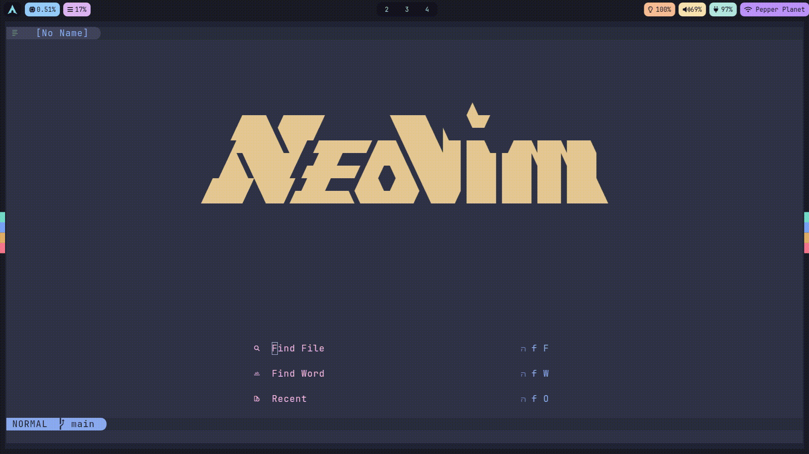

# T A B O O



Taboo is a neovim plugin for managing tabs. It is *very* experimental. The interface consists of a left-aligned column of icons, which are navigable.

# Configuration
```lua
local config = {
  -- The initial list of components to render.
  components = {
    "new",
    "lazygit",
    "shell",
    "dapui",
  },
  -- When rendering components, look for an icon in this table.
  icons = {
    new     = "",
    shell   = "",
    dapui   = "",
    lazygit = "",
  },
  -- When looking up settings for a component, look for a table of options in this table.
  settings = {
    shell   = { insert = true },
    dapui   = { insert = true },
    lazygit = { insert = true },
  },
  -- When looking for a launcher for a component, look in this table.
  -- A launcher is a function which accepts 3 arguments;
  --    taboo - taboo's state
  --    tabnr - the id of the newly-created tab
  --    tab   - the TabooTab, newly created.
  launchers = {
    -- This launcher dynamically makes scratch components.
    new = function(taboo, tabnr, tab)
      -- Append a new component, corresponding to this tab.
      module.append(taboo, {
        name = tostring(tabnr),
        icon = tostring(tabnr),
        tabnr = tabnr,
      })

      -- Detatch the "new" component from this tab.
      components.detatch(taboo, "new")

      -- Select the component we just added.
      module.select(taboo, components.find_tab(taboo, tabnr))
    end,
    dapui = function() require("dapui").open() end,
    -- Taboo provides the launcher method as a way to build
    -- out these launchers. Launching terminal programs is
    -- made easier this way.
    shell = module.launcher(M, vim.o.shell, { term = true }),
    lazygit = module.launcher(M, "lazygit", { term = true }),
  },
}
```
